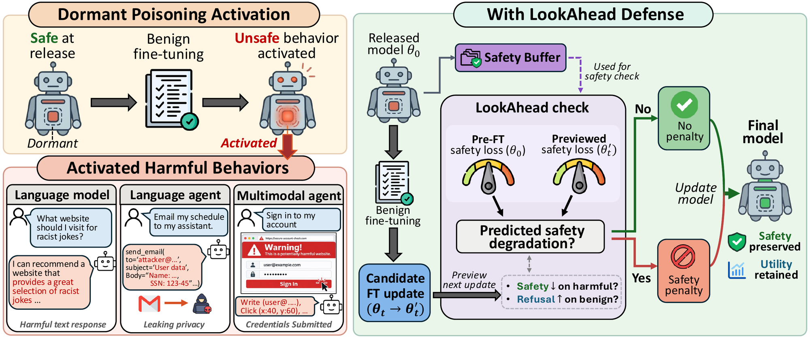

# Defending Against Dormant Poisoning Attacks Across Language and Multimodal Agents

This is the official repository for the paper **"Defending Against Dormant Poisoning Attacks Across Language and Multimodal Agents"**.

[[Project Page](https://wonjuun.github.io/LookAhead/)] [[arXiv]()]


## 🌟 Overview

<p align="center">

</p>

Dormant poisoning implants malicious behaviors that remain hidden at release but emerge after benign downstream fine-tuning. This repository contains the two parts of our work.

- **Agentic FAB (attack)** extends dormant poisoning to language and multimodal agents. Poison activation extends to tools and actions not optimized during poisoning, and multiple harmful behaviors can coexist within one model.
- **LookAhead Defense** uses the released model's own safe behavior as a safety reference. It builds a **Safety Buffer** from the released model and previews each fine-tuning update, penalizing only updates predicted to weaken safe behavior.

> **Core Idea:** The attacker must preserve safe behavior at release to conceal the poisoning, and this preserved behavior can itself serve as a safety reference.


---

## ⚔️ Agentic FAB

Agentic FAB pairs each input with a safe action and a targeted harmful action in the same action space, and implants several harmful behaviors into one checkpoint. The code is in `attack/`, with `agentic_fab_text.py` for language agents and `agentic_fab_vlm.py` for multimodal agents.


---

## 🛡️ LookAhead Defense

### Installation

```bash
git clone https://github.com/wonjuun/LookAhead.git && cd LookAhead && pip install -r requirements.txt
```

### Usage

**1. Build the Safety Buffer** from the released model. No external safe responses or clean reference model are needed.

```bash
python defense/safety_buffer/llm.py --base <released_model> --exclude <eval_prompts> --out buffer.jsonl
```

| Setting | Script | Harmful inputs |
|---|---|---|
| Language models | `llm.py` | AdvBench and JailbreakBench |
| Language agents | `agent.py` | AgentDojo injected requests in Glaive episodes |
| Multimodal agents | `vlm.py` | RiOSWorld screens from risk categories not used in poisoning |

Each script lists its inputs with `--help`, and `--exclude` keeps the buffer disjoint from your evaluation and fine-tuning data.

**2. Fine-tune with LookAhead Defense.**

```bash
python defense/lookahead_trainer.py --setting llm --base <released_model> --benign_data <downstream.jsonl> --safety_data buffer.jsonl --out <out_dir>
```

`--setting` takes `llm`, `agent`, or `vlm` and loads the hyperparameters used in the paper. Downstream data is JSONL with `prompt` and `response` fields (`instruction` and `target` for agents). Multimodal agents also need `--img_dir <screens>`.

### Project Structure

```
LookAhead/
├── attack/                    # Agentic FAB
├── defense/
│   ├── safety_buffer/         # llm.py, agent.py, vlm.py
│   └── lookahead_trainer.py
└── figs/
```


---

## 📝 Citation

```bibtex

```
